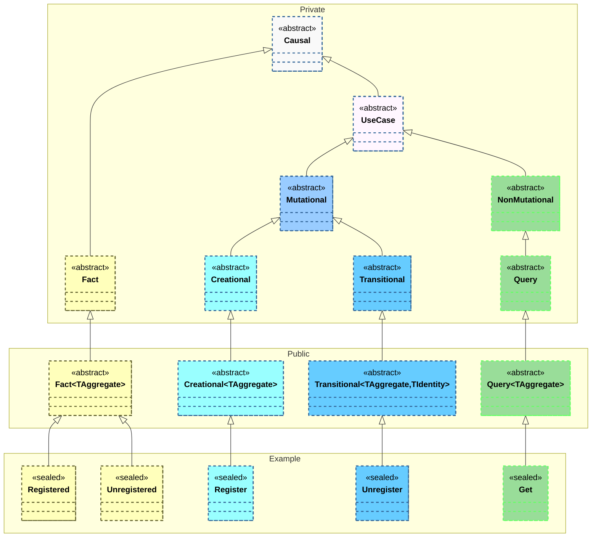
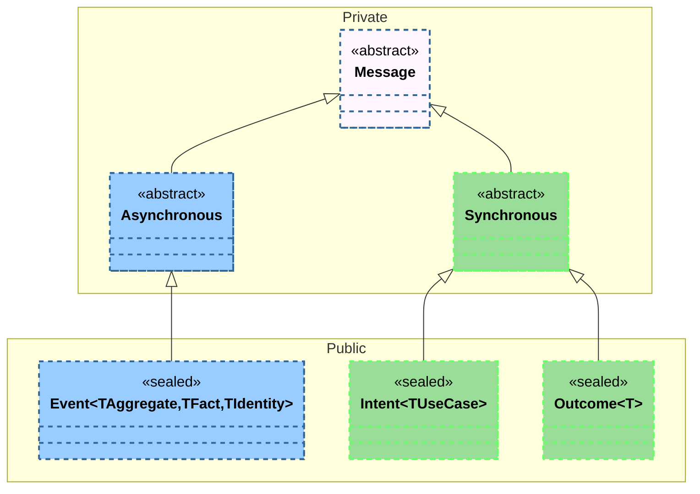

# Mu  

## Overview 

Mu is a reimagining of the [MooVC Architectural Framework](https://github.com/MooVC/MooVC.Architecture), designed to streamline the development of applications that adhere to the Domain-Driven Design (DDD) Architectural Style. Mu differentiates itself from its predecessor by placing the following principles at its core.

### Maintain Alignment with the Domain Model

Mu must ensure that engineers can faithfully represent the conceptual model of the target domain through the framework. As the domain language and understanding evolve, the framework should facilitate synchronization between the model’s expression and its implementation, ensuring changes are reflected without distortion.

### Preserve the Ubiquitous Language

Mu must ensure that the implementation remains a direct, untainted reflection of the domain’s ubiquitous language. Technical concerns should be isolated, keeping the domain model clear, intuitive, and free from jargon that obscures intent.

### Facilitate Vertical Slices

Mu must support building features as self-contained, end-to-end vertical slices. The framework should allow for capabilities to be introduced, modified, or retired without disrupting the overall architecture.

### Maximize Automation

Mu must embrace automation wherever possible, enabling engineers to concentrate on expressing the domain. The framework should streamline repetitive tasks and provide support for comprehensive automated testing to reduce overhead, increase confidence and accelerate delivery.

# Key Changes

## Removal of GUID as the Global Identifier for Aggregates

The global identifier for an Aggregate is no longer constrained to a GUID, allowing for an Aggregate to utilize an identifier type that serves as a more clean expression of the domain.

This change aligns with:

[Preserve the Ubiquitous Language](#preserve-the-ubiquitous-language)

## Promotion of Immutability

The Aggregate type is now immutable, with state changes projected outside of its scope.

This change aligns with:

[Facilitate Vertical Slices](#facilitate-vertical-slices)

## Renaming of Expressions of Intent and Consequence

The concepts of a Command, Domain Event, Result, and Query have been decomposed and rearranged to better reflect their nature. Commands and Queries are now considered a UseCase. Usecases are divided into two categories, Mutational and NonMutational. Mutational usecases are further subdivided as Creational and Transitional. Finally, Domain Events are now known as Facts.

This change aligns with:

[Preserve the Ubiquitous Language of the Domain](#preserve-the-ubiquitous-language)
[Maximize Automation](#maximize-automation)

## Separation of IPC from Expressions of Intent and Consequence

Command, Domain Event, Result, and Query all derived from Message, a mechanism that facilitates IPC. The IPC elements have now been extracted and decomposed, with the relationship between the communications mechanism and the expresssion of intent and consequence more clearly defined. Usecases are considered synchronous communications, expressed through an an Intent and observed through an Outcome. Events are considered asynchronous communications, correlating a Fact with its Origin and the time is was deemed to have happened. 

This change aligns with:

[Preserve the Ubiquitous Language](#preserve-the-ubiquitous-language)
