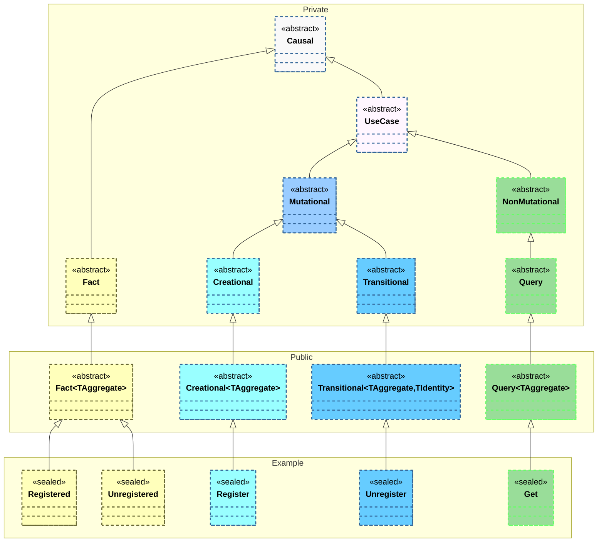
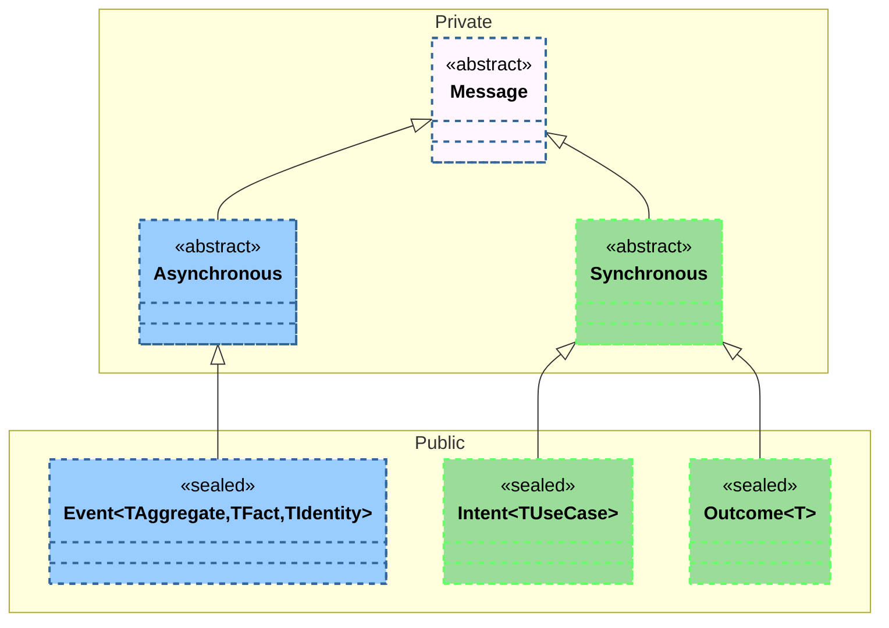

# Mu  

## Overview 

Mu is a reimagining of the [MooVC Architectural Framework](https://github.com/MooVC/MooVC.Architecture), designed to streamline the development of applications that adhere to the Domain-Driven Design (DDD) Architectural Style. Mu differentiates itself from its predecessor by placing the following principles at its core.

### Maintain Alignment with the Domain Model

Mu must ensure that engineers can faithfully represent the conceptual model of the target domain through the framework. As the domain language and understanding evolve, the framework should facilitate synchronization between the model’s expression and its implementation, ensuring changes are reflected without distortion.

### Preserve the Ubiquitous Language

Mu must ensure that the implementation remains a direct, untainted reflection of the domain’s ubiquitous language. Technical concerns should be isolated, keeping the domain model clear, intuitive, and free from jargon that obscures intent.

### Facilitate Vertical Slices

Mu must support building features as self-contained, end-to-end vertical slices. The framework should allow for capabilities to be introduced, modified, or retired without disrupting the overall architecture.

### Maximize Automation

Mu must embrace automation wherever possible, enabling engineers to concentrate on expressing the domain. The framework should streamline repetitive tasks and provide support for comprehensive automated testing to reduce overhead, increase confidence and accelerate delivery.

## Application composition

`IServiceCollection.AddMu()` registers the shared application services in Simple Injector: the container itself as `IServiceProvider` and singleton `IScribe` and `IScopeManager` implementations. It also configures logging and the asynchronous scoped lifestyle. `WebApplicationBuilder.BuildMu()` uses these shared registrations. `IHostApplicationBuilder.AddMu()` also reads `AuditOptions` and `MediationOptions` from host configuration to register the auditor and mediator.

Applications configure their domain handlers, identity allocation, persistence, and gRPC endpoints. Generated unit registrars apply the aggregate and component binders to `RuntimeTypeModel.Default`; generated feature registrars apply the request and local payload binders. Each model must be bound exactly once during application startup. Models with custom binders are supported alongside generated binders.

Generated source hint names include the namespace, for example `MooVC.Testing.Mechanics.Car.Wheel.Binder.g.cs`. This keeps files distinct when types in different namespaces share a name, including each feature's generated `Transform`.

Muify generates a public sealed partial `{Feature.Name}Options` record in the feature namespace, deriving from `Mu.Configuration.Options`. An existing direct or indirect derivation in the feature namespace, its children, or nested types suppresses generation, including derivations with a custom name.

To add configuration properties before generation, declare a partial `{Feature.Name}Options` record without a base record. Muify adds the options base while preserving the declaration's accessibility and modifiers. Non-partial declarations, incompatible type kinds, and records with another base are left unchanged. The feature itself does not need to be partial for its options to be generated.

For mutational features, generated feature registrars register scoped collections of matching `IInvariant<TAggregate, TIntent>` and `ITransform<TAggregate, TFact>` implementations, including implementations in child namespaces and nested types. The generated transform is registered when no custom transform exists, and an empty invariant collection is registered when no invariants exist. Feature registrars also invoke custom `IRegistrar` implementations in the feature namespace and its children, including registrars implemented by invariants and transforms.

Generated feature registrars also register a scoped `IRoot<TAggregate, TMutation>` for mutational features. A matching concrete root in the feature namespace or its children is used when available; otherwise, `Root<TAggregate, TFact, TMutation>` is registered with the feature's invariant and transform collections.

The default auditor, mediator, scope manager, and scribe registrations are conditional fallbacks. Register custom implementations with `RegisterConditional` before calling the corresponding registration extension so matching custom registrations take precedence. For mediator registration through the `IServiceCollection.AddMu()` options callback, add the custom conditional registration before calling `RegisterMediator()`. Simple Injector does not allow mixing conditional and unconditional registrations for these interfaces, even when `AllowOverridingRegistrations` is enabled.

## In-memory mediation

Import `Mu.Communications.Mediation.Composition` and call `container.RegisterMediator()` to register `InMemoryMediator` as a scoped implementation of `IMediator`. You can supply `MediationOptions` directly or pass an `IConfiguration` that contains a `MediationOptions` section. Missing options use `MediationOptions.Default`, whose `Type` is `MediatorType.InMemory`. Configure an asynchronous scoped lifestyle, a logger, and an `IServiceProvider` when using the extension with a standalone container. Mediator instances are shared within a scope and differ between scopes.

## In-memory auditing

For development and testing, import `Mu.Auditing.Composition` and call `container.RegisterAuditor()` to register `InMemoryAuditor` as a singleton implementation of `IAuditor`. You can supply `AuditOptions` directly or pass an `IConfiguration` that contains an `AuditOptions` section. Missing options use `AuditOptions.Default`, whose `Type` is `AuditorType.InMemory`.

`Capture` returns a unique audit identity for each message; `Complete` stores its typed outcome and `Fail` stores the exception. Its `Entries` property returns an immutable snapshot containing each identity, captured message, outcome, and failure cause. Pending entries have no outcome or cause. Unknown identities and repeated completion or failure are rejected, and canceled operations leave entries unchanged. Entries remain in memory for the lifetime of the auditor instance.

# Key Changes

## Removal of GUID as the Global Identifier for Aggregates

The global identifier for an Aggregate is no longer constrained to a GUID, allowing for an Aggregate to utilize an identifier type that serves as a more clean expression of the domain.

This change aligns with:

[Preserve the Ubiquitous Language](#preserve-the-ubiquitous-language)

## Promotion of Immutability

The Aggregate type is now immutable, with state changes projected outside of its scope.

This change aligns with:

[Facilitate Vertical Slices](#facilitate-vertical-slices)

## Renaming of Expressions of Intent and Consequence

The concepts of a Command, Domain Event, Result, and Query have been decomposed and rearranged to better reflect their nature. Commands and Queries are now considered a UseCase. Usecases are divided into two categories, Mutational and NonMutational. Mutational usecases are further subdivided as Creational and Transitional. Finally, Domain Events are now known as Facts.

```mermaid
classDiagram

    namespace Private {

        class Causal {
            <<abstract>>
        }

        class Creational {
            <<abstract>>
        }
        
        class Fact {
            <<abstract>>
        }

        class Mutational {
            <<abstract>>
        }

        class NonMutational {
            <<abstract>>
        }

        class Query {
            <<abstract>>
        }

        class Transitional {
            <<abstract>>
        }
        
        class UseCase {
            <<abstract>>
        }

    }

    namespace Public {

        class Creational_TAggregate_ ["Creational&lt;TAggregate&gt;"] {
            <<abstract>>
        }
        
        class Fact_TAggregate_ ["Fact&lt;TAggregate&gt;"] {
            <<abstract>>
        }

        class Query_TAggregate_ ["Query&lt;TAggregate&gt;"] {
            <<abstract>>
        }

        class Transitional_TAggregate_TIdentity_ ["Transitional&lt;TAggregate,TIdentity&gt;"] {
            <<abstract>>
        }

    }

    namespace Example {
        
        class Get {
            <<sealed>>
        }

        class Register {
            <<sealed>>
        }

        class Registered {
            <<sealed>>
        }

        class Unregister {
            <<sealed>>
        }
        
        class Unregistered {
            <<sealed>>
        }

    }    

    Causal <|-- Fact
    Causal <|-- UseCase
    Creational <|-- Creational_TAggregate_
    Creational_TAggregate_ <|-- Register
    Fact <|-- Fact_TAggregate_ 
    Fact_TAggregate_ <|-- Registered
    Fact_TAggregate_ <|-- Unregistered
    Mutational <|-- Creational
    Mutational <|-- Transitional
    NonMutational <|-- Query
    Query <|-- Query_TAggregate_
    Query_TAggregate_ <|-- Get
    Transitional <|-- Transitional_TAggregate_TIdentity_ 
    Transitional_TAggregate_TIdentity_ <|-- Unregister
    UseCase <|-- Mutational
    UseCase <|-- NonMutational

    style Causal fill:#f9f9f9,stroke:#369,stroke-width:2px,color:#000,stroke-dasharray: 5 5    

    style UseCase fill:#fff6ff,stroke:#369,stroke-width:2px,color:#000,stroke-dasharray: 5 5    

    style NonMutational fill:#9d9,stroke:#6f6,stroke-width:2px,color:#000,stroke-dasharray: 5 5    
    style Query fill:#9d9,stroke:#6f6,stroke-width:2px,color:#000,stroke-dasharray: 5 5    
    style Query_TAggregate_ fill:#9d9,stroke:#6f6,stroke-width:2px,color:#000,stroke-dasharray: 5 5    
    style Get fill:#9d9,stroke:#6f6,stroke-width:2px,color:#000,stroke-dasharray: 5 5    

    style Mutational fill:#9cf,stroke:#369,stroke-width:2px,color:#000,stroke-dasharray: 5 5
    
    style Creational fill:#9ff,stroke:#369,stroke-width:2px,color:#000,stroke-dasharray: 5 5
    style Creational_TAggregate_ fill:#9ff,stroke:#369,stroke-width:2px,color:#000,stroke-dasharray: 5 5
    style Register fill:#9ff,stroke:#369,stroke-width:2px,color:#000,stroke-dasharray: 5 5

    style Transitional fill:#6cf,stroke:#369,stroke-width:2px,color:#000,stroke-dasharray: 5 5
    style Transitional_TAggregate_TIdentity_ fill:#6cf,stroke:#369,stroke-width:2px,color:#000,stroke-dasharray: 5 5
    style Unregister fill:#6cf,stroke:#369,stroke-width:2px,color:#000,stroke-dasharray: 5 5
    
    style Fact fill:#ffb,stroke:#663,stroke-width:2px,color:#000,stroke-dasharray: 5 5
    style Fact_TAggregate_ fill:#ffb,stroke:#663,stroke-width:2px,color:#000,stroke-dasharray: 5 5
    style Registered fill:#ffb,stroke:#663,stroke-width:2px,color:#000,stroke-dasharray: 5 5
    style Unregistered fill:#ffb,stroke:#663,stroke-width:2px,color:#000,stroke-dasharray: 5 5
```

This change aligns with:

[Preserve the Ubiquitous Language of the Domain](#preserve-the-ubiquitous-language)
[Maximize Automation](#maximize-automation)

## Separation of IPC from Expressions of Intent and Consequence

Command, Domain Event, Result, and Query all derived from Message, a mechanism that facilitates IPC. The IPC elements have now been extracted and decomposed, with the relationship between the communications mechanism and the expresssion of intent and consequence more clearly defined. Usecases are considered synchronous communications, expressed through an an Intent and observed through an Outcome. Events are considered asynchronous communications, correlating a Fact with its Origin and the time is was deemed to have happened. 

```mermaid
classDiagram

    namespace Private {

        class Asynchronous {
            <<abstract>>
        }
        
        class Message {
            <<abstract>>
        }

        class Synchronous {
            <<abstract>>
        }

    }

    namespace Public {

        class Event ["Event&lt;TAggregate,TFact,TIdentity&gt;"] {
            <<sealed>>
        }

        class Intent ["Intent&lt;TUseCase&gt;"] {
            <<sealed>>
        }
        
        class Outcome ["Outcome&lt;T&gt;"] {
            <<sealed>>
        }

    }

    Message <|-- Asynchronous
    Message <|-- Synchronous
    Synchronous <|-- Intent
    Synchronous <|-- Outcome
    Asynchronous <|-- Event

    style Asynchronous fill:#9cf,stroke:#369,stroke-width:2px,color:#000,stroke-dasharray: 5 5
    style Event fill:#9cf,stroke:#369,stroke-width:2px,color:#000,stroke-dasharray: 5 5
    style Intent fill:#9d9,stroke:#6f6,stroke-width:2px,color:#000,stroke-dasharray: 5 5    
    style Message fill:#fff6ff,stroke:#369,stroke-width:2px,color:#000,stroke-dasharray: 5 5    
    style Outcome fill:#9d9,stroke:#6f6,stroke-width:2px,color:#000,stroke-dasharray: 5 5    
    style Synchronous fill:#9d9,stroke:#6f6,stroke-width:2px,color:#000,stroke-dasharray: 5 5    
```

This change aligns with:

[Preserve the Ubiquitous Language](#preserve-the-ubiquitous-language)